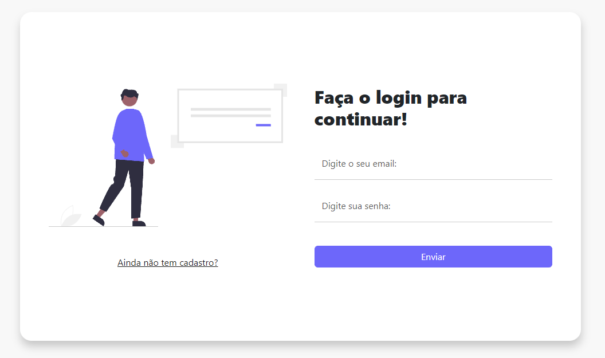

## Sobre
Projeto de tela de login com bootstrap

## Bootstrap
Para aprender a usar mais o bootstrap, precisei usar mais algumas classes e conceitos que não conhecia, como:

* form control
* checkbox do bootstrap
* floating labels
* layout com forms
etc

<h4>Esse projeto é bem simples, apenas para aprender alguns conceitos básicos de <strong>bootstrap forms</strong></h4>

 

    

  

<h1 align="center"><a href="https://felilpz.github.io/tela-login/">IR PARA PROJETO</a></h1 align="center">